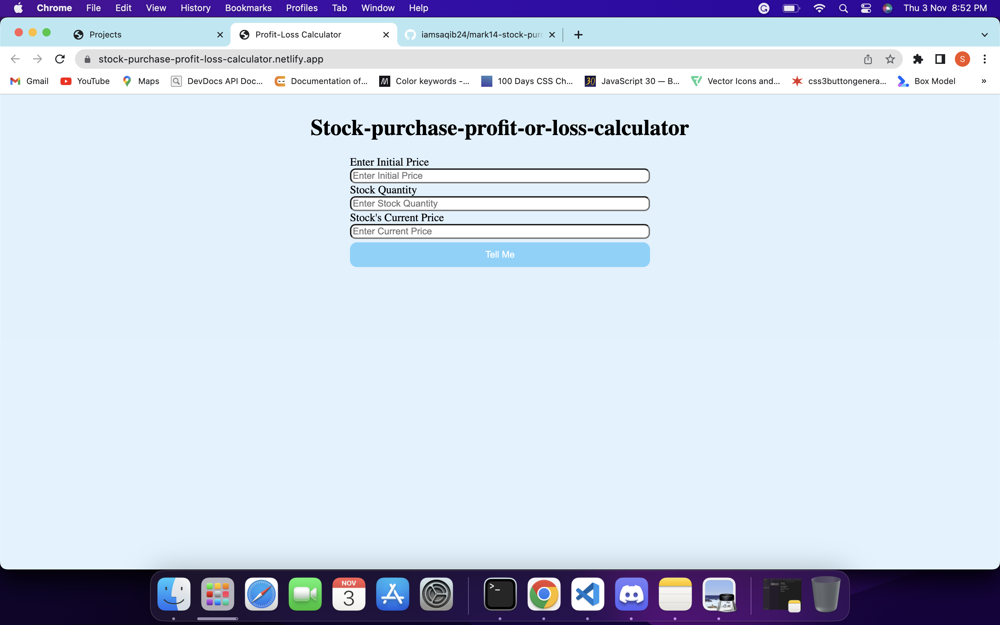

# Mark14-Stock-Purchase-Profit-or-loss

This app basically the stock profit-loss calculator. It takes the buying price of stock, quantity (How many purchased) of stock and current price of stock as input. And after processing it will tell you how much profit or loss you have made.

## Technologies i used to build this:

1. HTML
2. CSS
3. JavaScript

## Project is live on the server, to check [click here](https://stock-purchase-profit-loss-calculator.netlify.app/)

## Image

